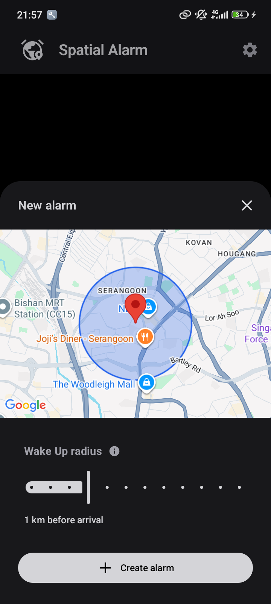

# Spatial Alarm [](LICENSE)

A lightweight Android app for setting alarms that wake you before you reach your destination.

## Motivation

Traditional alarms depend on time, which is unreliable when a journey is delayed or arrives early. Spatial Alarm is intended for commuters who want to rest without worrying about missing their stop.

- Location-based wake-up radius
- Metric and imperial distance presets
- Radius guidance for walking, bus, and train journeys
- Light, dark, and system themes
- Interactive map preview

## Usage

Add a Google Maps SDK key to `local.properties`, then build and install the
debug app on a connected Android device or emulator:

```properties
MAPS_API_KEY=your_api_key
```

```bash
./gradlew installDebug
```

Run the unit tests with:

```bash
./gradlew test
```

## Preview

<p align="center">
  
</p>
